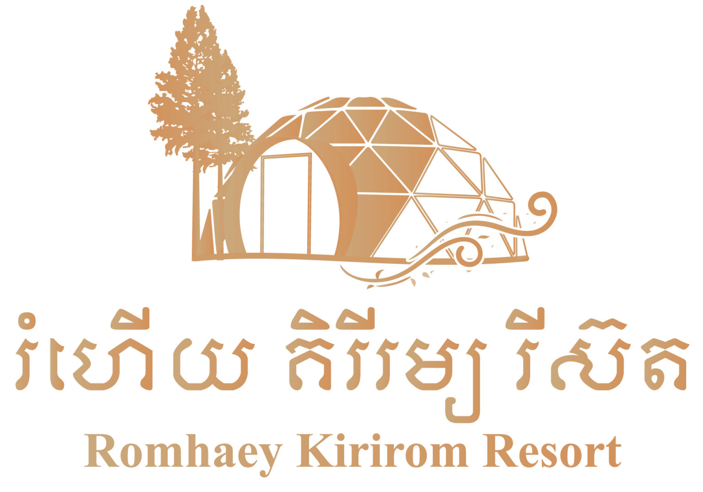
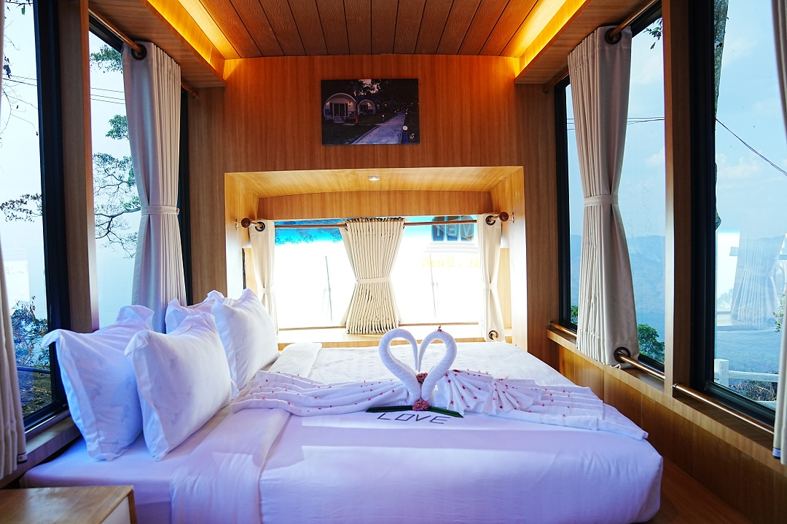
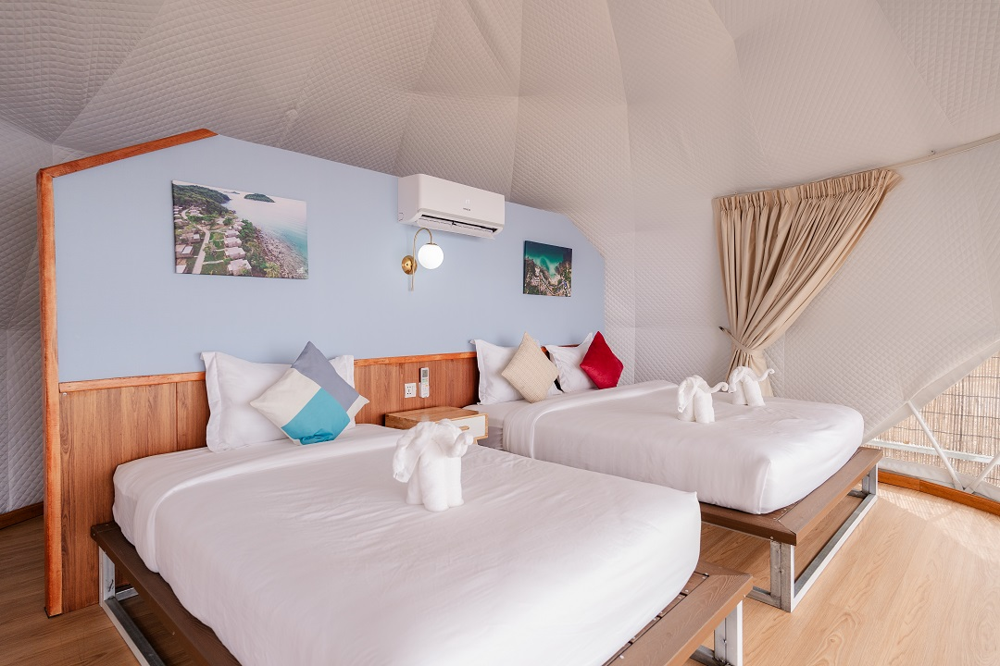
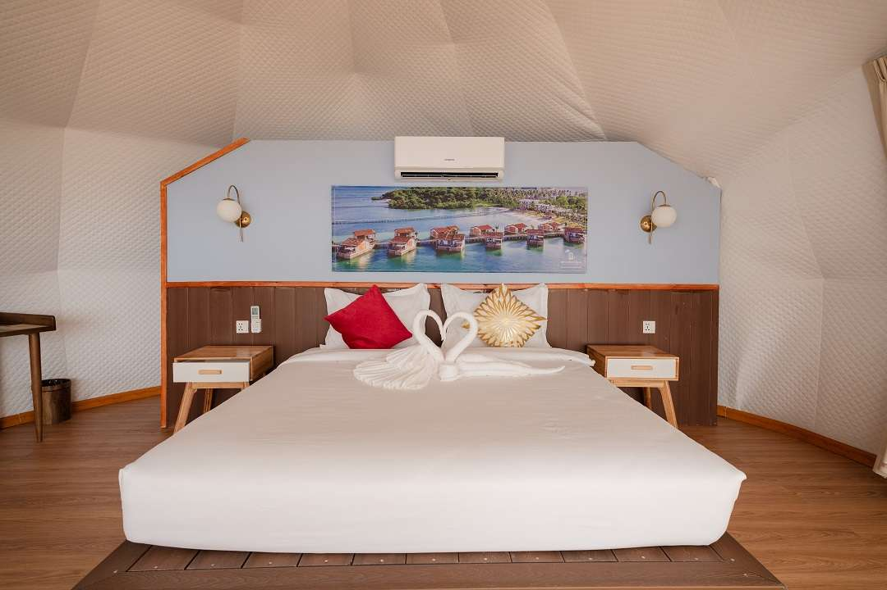
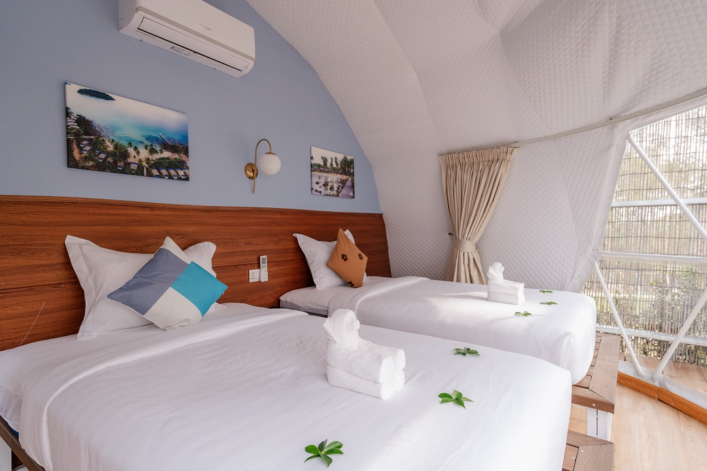
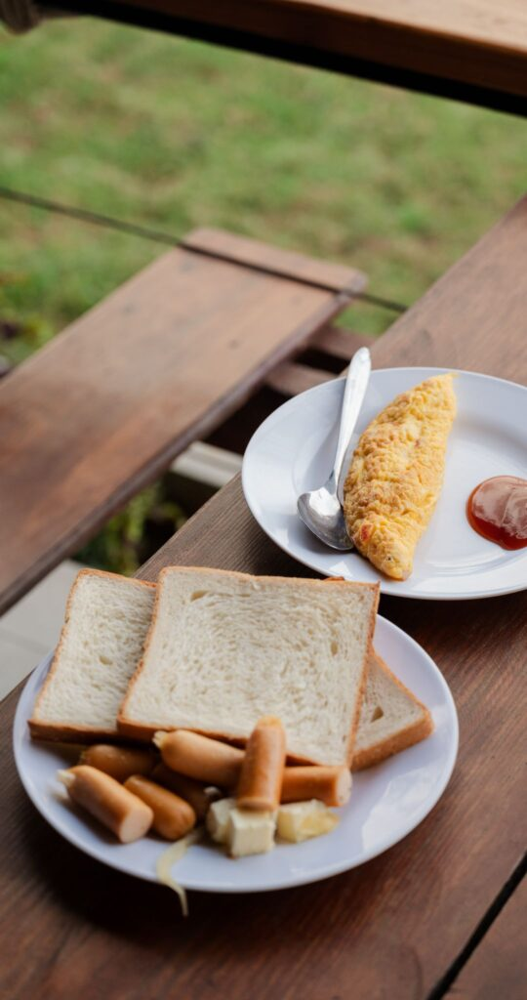
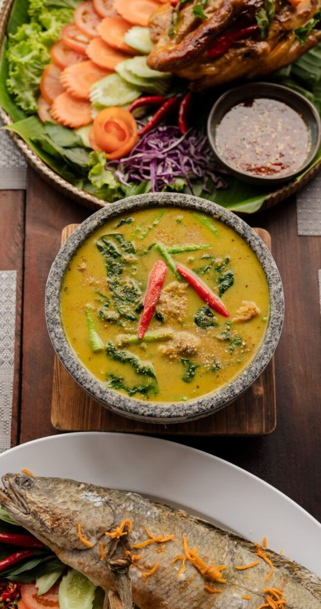
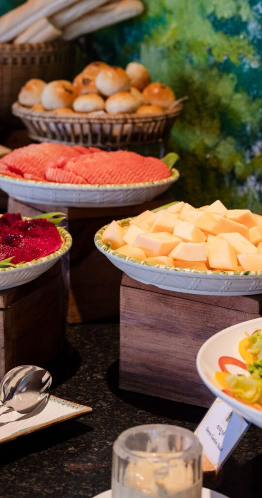
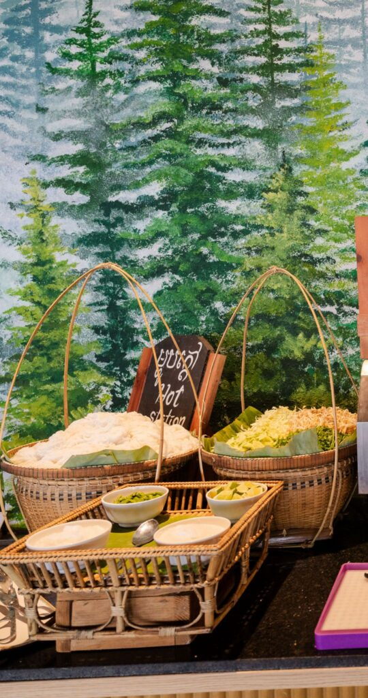
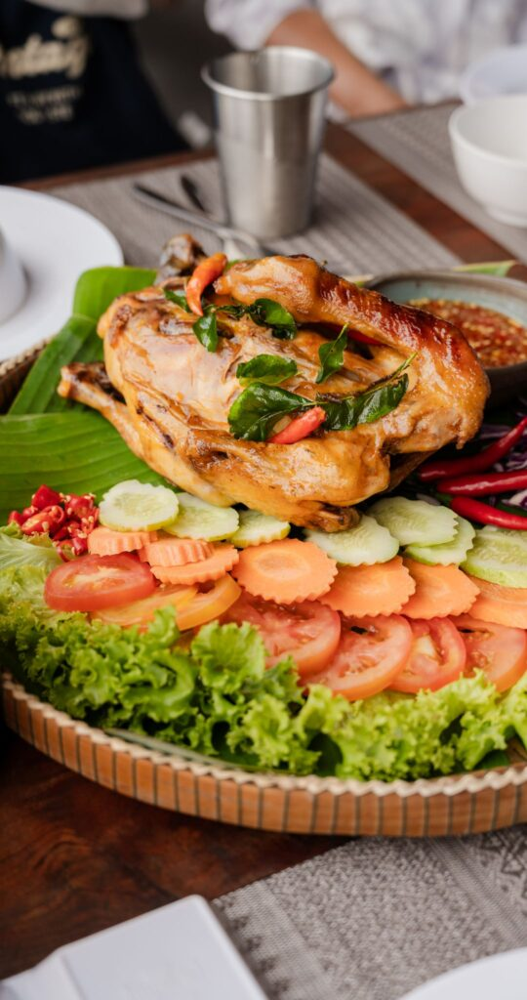

<!DOCTYPE html>
<html>
<head>
    <title>Romhaey Kirirom Resort</title>
    <link rel="stylesheet" href="Style.css">
    <link rel="stylesheet" href="https://cdnjs.cloudflare.com/ajax/libs/font-awesome/6.6.0/css/all.min.css" integrity="sha512-Kc323vGBEqzTmouAECnVceyQqyqdsSiqLQISBL29aUW4U/M7pSPA/gEUZQqv1cwx4OnYxTxve5UMg5GT6L4JJg==" crossorigin="anonymous" referrerpolicy="no-referrer" />
</head>
<body>
  

    

      
    

    

  <h1>Romhaey Kirirom Resort </h1 >
  

  

  <nav class="first">
  
    <ul>
        <li><a href="#section1"> About Us</a></li>
        <li><a href="#section2"> Rooms</a></li>
        <li><a href="#section3"> Dining</a></li>
        <li><a href="#section4"> Contact Us</a></li>
        <li><a href="#section5"> Location</a></li>

      </ul>
  </nav>
    <section id="section1">
      
 

      

      

     <h1>Romhaey Kirirom Resort</h1>
    
Romhaey Kirirom Resort is a newly built 4 stars mountain top resort in Kirirom National Park. Located at an altitude of 800 – 850 m, the area offers a fresh and unique experience. With spectacular views towards the Cardamom Mountains the detached bungalows are secluded positioned amongst the pine forest and clean mountain air to invigorate your senses.

    <section id="section2">
      <h1>Rooms</h1>
      

        

         

        

        <h1>Family Hotel Bus – Mountain View</h1>
        

          Discover a one-of-a-kind stay in our Hotel Bus, blending adventure with comfort. The cleverly coverted from the bus to hotel room. Family Hotel Bus includes 2 bedrooms and a huge balcony with mountain view.
        

        <button>Explore</button>
        

        

        

        
        

        

        <h1>Deluxe Family – Mountain View
        </h1>
        

          Experience unparalleled comfort and tranquility in our Deluxe Family with a stunning mountain view. 

        <button>Explore</button>
        
        

        

        

          

           

          

          <h1>Deluxe Family – Jungle View</h1>
          

            Immerse yourself in nature’s embrace with our Deluxe Family featuring a captivating jungle view.
          

          <button>Explore</button>
          

          

          

            

             

            

            <h1>Deluxe Double – Jungle View</h1>
            

              Immerse yourself in nature’s embrace with our Deluxe Double featuring a captivating jungle view.
            

            <button>Explore</button>
            

            

              

               

              

              <h1>Family Hotel Bus – Mountain View</h1>
              

                Discover a one-of-a-kind stay in our Hotel Bus, blending adventure with comfort. The cleverly coverted from the bus to hotel room. Family Hotel Bus includes 2 bedrooms and a huge balcony with mountain view.
              

              <button>Explore</button>
              

              

                

                 

                

                <h1>Family Suite – Jungle View</h1>
                

                  Immerse yourself in nature’s embrace with our Deluxe Double featuring a captivating jungle view.
                

                <button>Explore</button>
                

                

        

    </section>
    <section id="section3">

      <h1>Restaurant Romhaey Resort</h1>
      
      
Romdoul Restaurant is open for Breakfast, Lunch & Dinner. The buffet breakfast offers a delightful variety of food including freshly baked breads and pastries. Soup Station, Egg station, and Hot station will whet your appetite and leave you fully satisfied.
        Lunch & Dinner options included Authentic Khmer & Thai dishes, using organic vegetables & local fresh ingredients prepared expertly by our Cambodian Head Chef. Western tastes are catered for with a selection of Snacks, Burgers, Pizzas & Imported Steaks.

      

         
         
         
         
         

      

   
      </section>
      

     
      <section id="section4">

      
      

      <h1> Contact Us</h1>
      

        <i class="fa-solid fa-phone"></i> +855 17 778 873  
        <i class="fa-solid fa-envelope"></i> info@romhaeykiriromresort.com  
        <i class="fa-solid fa-location-dot"></i> Ou Bak Roteh, Kampong Seila, Sihanoukville

      </section>
      

    

    <section id="section5">
      <h1>Location</h1>
    <iframe src="https://www.google.com/maps/embed?pb=!1m14!1m8!1m3!1d62581.37748910777!2d103.9573352!3d11.3831174!3m2!1i1024!2i768!4f13.1!3m3!1m2!1s0x3108c30055e0857b%3A0x411bff7d355e6eba!2sRomhaey%20Kirirom%20Resort!5e0!3m2!1sen!2skh!4v1731867181319!5m2!1sen!2skh" width="600" height="450" style="border:0;" allowfullscreen="" loading="lazy" referrerpolicy="no-referrer-when-downgrade"></iframe> 
    </section>  
    

      

  </body>
</html>

@import url('https://fonts.googleapis.com/css?family=Inter:wght@500; 600; 700&display=swap');
  /* *{    */
    margin: 0;
    padding: 0;
    box-sizing: border-box;
    font-family: 'Inter', sans-serif;
    color: white;
}
body {

width: 100%;
height: 100vh;
display: flex;
align-items: center;
justify-content: center;
}
.card-group {

display: flex;
gap: 25px;
}
.card {
width: 225px;
height: 400px;
border-radius: 16px;
overflow: hidden;
position: relative;
transition: 0.5s;
cursor: pointer;
}
.card img {

width: 100%;
height: 100%;
object-fit: cover;
pointer-events: none;
transition: 0.5s;
}
.card .layer {
background: linear-gradient(to top, rgb(250, 250, 250), rgba(0, 0, 0, 0));
position: absolute;
bottom: 0;
width: 100%;
height: 75%;
opacity: 0;
transition: 0.3s;
}
.card .info {
position: absolute;
bottom: -50%;
padding: 15px;
opacity: 0;
transition: 0.5s bottom, 1.75s opacity;
}
.info p {

font-size: 14px;
margin-top: 3px;
}
.info button {
background: #490CCC;
border: none;
padding: 8px 12px;
font-weight: bold;
border-radius: 8px;
margin-top: 8px;
}
.card:hover, .card:hover img,
.card:hover layer {
transform: scale(1.1);
}
.card:hover > .layer {
opacity: 1;
}
.card:hover > .info {

bottom: 0;
opacity: 1;
}
.card-group:hover > .card:not(:hover) {
filter: blur (5px);
}
.dinner {
    margin: 100px 0 0 200px;
    width: 70%;
    height: 450px;
    display:flex;
    justify-content: center;
    gap: 10px;
}
.dinner image{
    width: 10%;
    height: 100%;
    object-fit: cover;
    border-radius: 10px;
    border: 2px solid;
    box-shadow: 0 0 10px rgba(0, 0, 0, 0.3);
    transition: all ease-in-out 0.5s;
}
.first ul{
   list-style-type: none;
   padding: 0px;
   margin: 0px;
   overflow: hidden;

}
.first a{
    text-decoration: none;
    padding: 15px;
    display: block;
    text-align: center;

}
.first li{
    float: left;

}
.first ul {
    display: flex;
    justify-content: space-around;
    align-items: center;
}
.container-box{
    width: 100%;
    height: auto;
    display: flex;
}
.logo{
    width: 20%;
    height: 110px;

}
.txt{
    width: 80%;
    height: auto;
    text-align: center;
}
.logo img{
    width: 100%;
    height: 100% ;

}
iframe{
    width: 100%;
    height: 300px;
}
